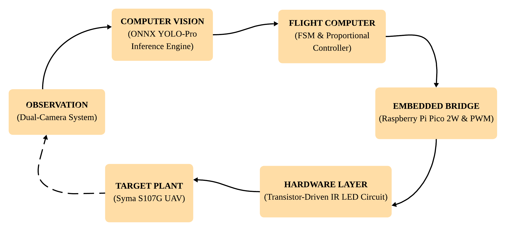
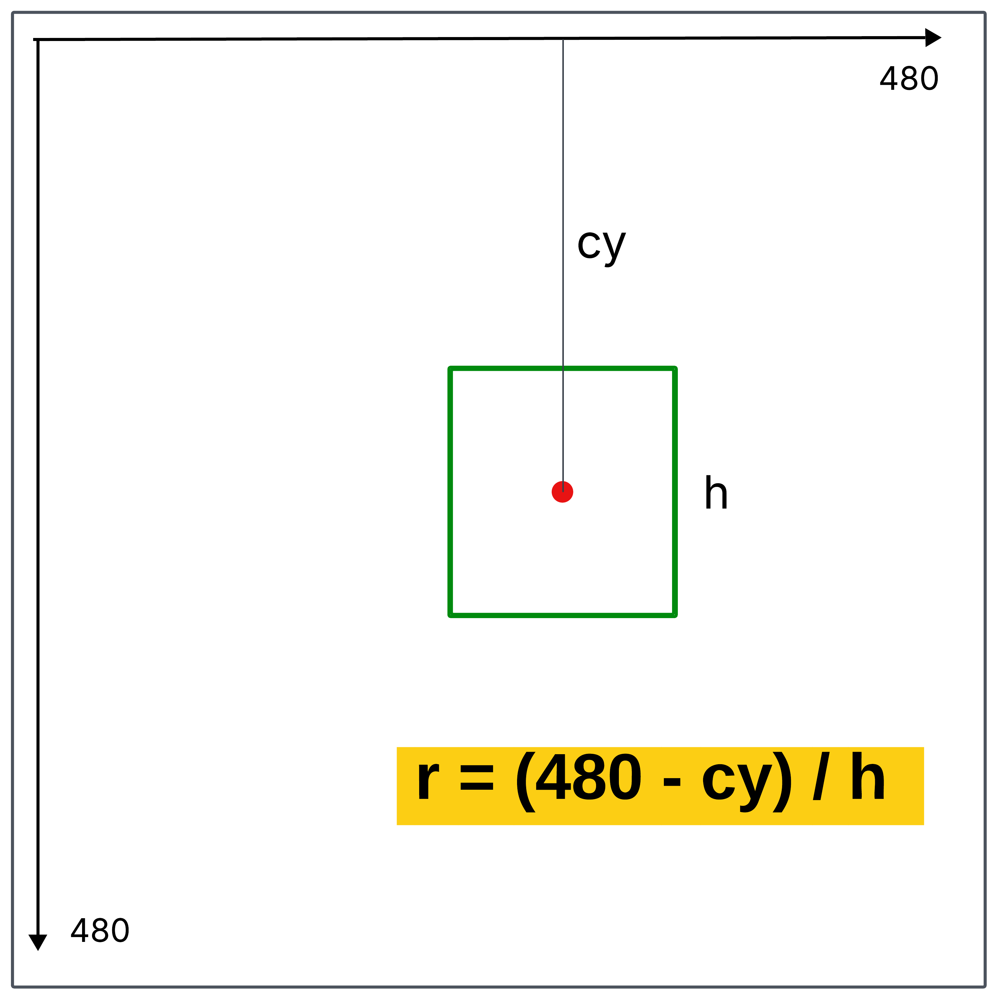
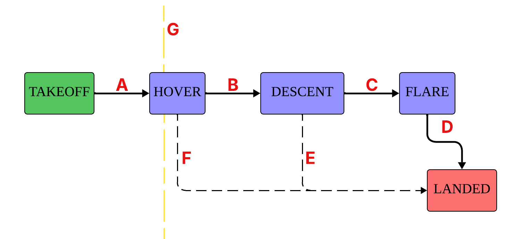
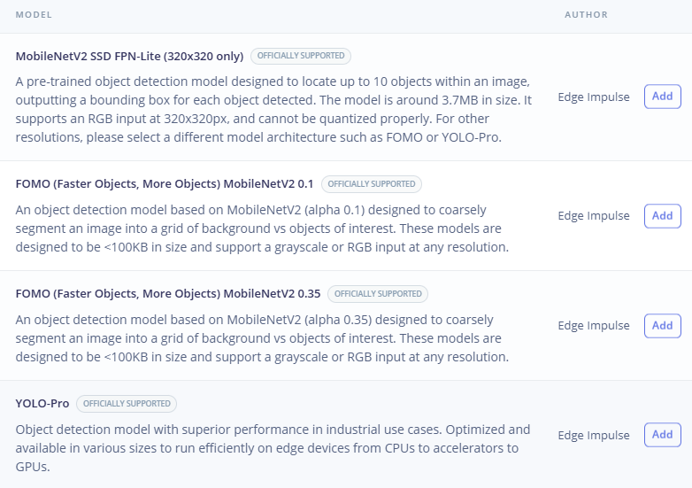
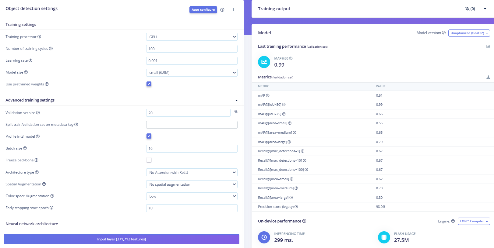
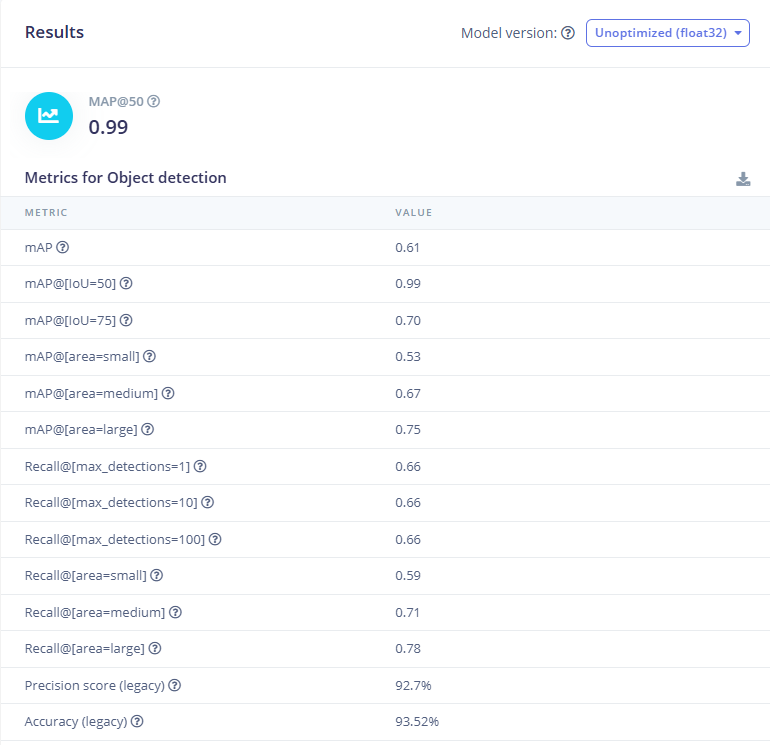
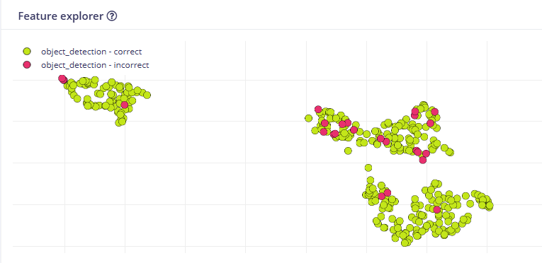

# Autonomous UAV Flight Control via Dual-Camera Computer Vision 

**Abstract** 

This project details the design and implementation of a complete closed-loop autonomous flight control system for an infrared (IR) actuated helicopter. The system integrates a dual-camera computer vision architecture with a YOLO-Pro machine learning model to achieve real-time spatial inference and aircraft tracking throughout its entire flight envelope.

The algorithmic decision-making core is governed by a Finite State Machine (FSM) and Proportional (P) controllers. The dynamic parameters and transition thresholds for this control logic were empirically derived from the rigorous capture and analysis of manual flight telemetry. High-level navigation instructions computed in Python are transmitted via serial protocol to an embedded Raspberry Pi Pico 2W. This microcontroller acts as the physical actuator, translating the logic into precise PWM-modulated infrared signals to execute the automated maneuvers.

### Key Technologies \& Methodologies

* **Computer Vision \& AI**: OpenCV, Edge Impulse (YOLO-Pro Object Detection), and ONNX Runtime for low-latency spatial inference.
* **Flight Control Theory**: Finite State Machine (FSM) architecture, closed-loop Proportional (P) altitude control, and odometry-based heading correction.
* **Embedded Hardware**: Raspberry Pi Pico 2W (C++/Arduino), custom transistor-based circuitry, and PWM infrared optical communications.
* **Data Acquisition \& Analysis**: Node.js for HID controller mapping, continuous CSV telemetry datalogging, and empirical parameter tuning.
* **Software Engineering**: Multi-threading in Python, cross-device serial communication, and modular system architecture.

## Autonomous Navigation \& Control Architecture 

The autonomous system operates on a continuous, low-latency closed loop connecting computer vision to physical hardware actuation. The information travels through the following pipeline:

* **Sensory Input**: The dual-camera setup (frontal and ground) captures real-time video frames of the flight zone.
* **Computer Vision (PC)**: The frames are preprocessed and fed into the ONNX YOLO model running on the main computer, which calculates the bounding box and center coordinates of the helicopter.
* **Decision Logic (PC)**: The Python finite state machine and PID controllers process the visual telemetry to compute the required Throttle, Yaw, and Pitch adjustments.
* **Serial Communication**: The calculated commands are packaged into a 6-byte hexadecimal array and transmitted via USB serial port at 25 Hz (every 40 ms) to the microcontroller.
* **Embedded Actuation (Pico 2W)**: The Raspberry Pi Pico 2W decodes the serial payload and generates precise PWM signals.
* **Hardware Layer**: The PWM signals drive a custom circuit utilizing a transistor and resistors to safely power the infrared (IR) LEDs, broadcasting the final command directly to the helicopter's optical receiver.

### Dual-Camera Architecture

Standard webcams and computer vision models struggle with resolution and tracking consistency when a small object moves far away. To significantly extend the flight range and vertical trajectory of the UAV, this system utilizes a dual-camera setup, seamlessly handing over control mid-flight.

* **Camera 0 (Frontal/Computer)**: Dedicated to the initial takeoff and lower-altitude hover phases.
* **Camera 1 (Downward/Ground)**: Positioned on the floor pointing upwards, taking over navigation as the drone climbs out of the frontal camera's optimal range. This camera specializes in precision ceiling hold, descent, and landing phases.

### Altitude Estimation via Geometric Ratio

To navigate autonomously without physical altimeters (like LiDAR or ultrasonic sensors), the system relies on a dimensionless visual metric: the Geometric Altitude Ratio.

The ratio is calculated continuously for the active camera using the following formula: **ratio = (CAM\_RES\_Y - cy) / bbox\_height**.

* **CAM\_RES\_Y - cy**: This measures the vertical distance from the bottom of the camera frame (CAM\_RES\_Y = 480) to the helicopter's center of mass (cy). As the UAV climbs, cy decreases (moving higher in the pixel grid), causing this distance to increase.
* **bbox\_height**: This represents the vertical pixel height of the helicopter's bounding box. As the UAV flies higher and further away from the lens, this value decreases due to perspective.
* **The Advantage**: By dividing the vertical position by the apparent size, the resulting ratio grows exponentially as the helicopter gains altitude. This creates a highly sensitive, scale-invariant proxy for height that remains robust even if the camera's physical pitch angle is slightly altered between flight tests.

### Finite State Machine (FSM) and Transition Logic

The flight protocol is governed by a strict state machine, where the core power output is anchored to a calibrated baseline, THROTTLE\_HOVER\_BASE (70).

* **State: TAKEOFF**. The flight initiates in an open-loop, time-driven state to safely overcome ground effect, monitored by Camera 0.

  1. **Behavior**: The throttle applies a linear power ramp starting at THROTTLE\_START (40) and peaking at THROTTLE\_TAKEOFF, calibrated as THROTTLE\_HOVER\_BASE - 6 (64).
  2. **Transition A (TAKEOFF --> HOVER)**: Triggers automatically once the flight time reaches the TAKEOFF\_RAMP\_TIME threshold of 1.5 seconds.
* **State: HOVER (Camera 0 - Initial Stabilization)**. The UAV stabilizes its altitude using a Proportional (P) controller driven by the frontal camera's visual telemetry.

  1. **Behavior**: The system computes the error against TARGET\_RATIO\_ALT\_CAM0 (2.9). The resulting correction, multiplied by KP\_ALT (3.25), is applied directly to the THROTTLE\_HOVER\_BASE (70). To prevent severe oscillations, output is clamped to a maximum variance of ±15 points from the base.
  2. **Transition G (Handover to Camera 1)**: The dynamic control transition requires three simultaneous conditions to ensure a safe handover:

     1. A minimum of 2.75 seconds (MIN\_TRANSITION\_SEC) must elapse from the start of the Hover state.
     2. The ground camera (CAM1) must positively detect the UAV (cam1\_cx > 0).
     3. The detection must be sustained for 5 consecutive frames (CAM\_TRANSITION\_FRAMES) to filter out noise.
* **State: HOVER (Camera 1 - Sustained Flight)**. Upon completing Transition G, the ground camera assumes full authority over odometry and altitude control.

  1. **Behavior**: The altitude PID controller updates its target ceiling to TARGET\_RATIO\_ALT\_CAM1 (5.0), dynamically adjusting around the THROTTLE\_HOVER\_BASE (70).
  2. **Transition B (HOVER --> DESCENT)**: Initiates the landing sequence once the UAV reaches the optimal ceiling. Requirements:

     1. A mandatory stabilization period under CAM1 control of 6.0 seconds (HOVER\_STABILIZE\_CAM1\_SEC).
     2. The UAV's center of mass must rise above the trigger line: cam1\_cy <= 180 (CY\_TRIGGER\_DESCENT).
     3. The geometrical condition must hold for 2 confirmation frames (CONFIRMATION\_FRAMES).
* **State: DESCENT**. The system forces a controlled altitude loss by systematically starving the motors.

  1. **Behavior**: The throttle ramps down from THROTTLE\_DESCENT\_START (THROTTLE\_HOVER\_BASE - 7, or 63) to THROTTLE\_DESCENT\_END (THROTTLE\_HOVER\_BASE - 11, or 59) over a period of 0.65 seconds (DESCENT\_RAMP\_TIME).
  2. **Transition C (DESCENT --> FLARE)**: Evaluates ground proximity to trigger aerodynamic braking:

     1. A minimum descent time of 0.25 seconds (DESCENT\_MIN\_SEC) must be surpassed.
     2. The CAM1 geometric ratio must drop to <= 3.05 (RATIO\_TRIGGER\_FLARE).
     3. Confirmed for 2 consecutive frames.
  3. **Transition E (DESCENT --> LANDED - Safety Timeout)**: If the UAV remains in the descent state for 1.5 seconds (DESCENT\_TIMEOUT\_SEC) without successfully triggering the flare, the system aborts the descent and kills the motors immediately to prevent near-ground instability.
* **State: FLARE**. A brief, high-power impulse applied right before touchdown to cushion the landing.		

  1. **Behavior**: The motors are driven at THROTTLE\_FLARE, set to THROTTLE\_HOVER\_BASE + 2 (72), sharply decelerating the vertical drop.
  2. **Transition D (FLARE --> LANDED)**: Strictly timer-driven. After 0.5 seconds (FLARE\_DELAY\_SEC), the flight cycle is terminated.
* **Transition F: Emergency Kill-Switch (to LANDED)**. An asynchronous, high-priority safety routine evaluated continuously across all active flight states. It forces the throttle to zero if an imminent hard impact is detected by CAM1. Activation requires:

  1. The UAV drops dangerously low in the frame: cam1\_cy >= 355 (CY\_GROUND\_EMERGENCY).
  2. The bounding box becomes excessively large due to proximity to the lens: cam1\_height > 110 (HEIGHT\_GROUND\_EMERGENCY).
  3. Both limits are breached for 3 consecutive frames (CONFIRMATION\_FRAMES + 1).

### Odometry-Based Yaw Pulse Control

The Yaw (heading) is actively controlled across all flight states. Coaxial toy helicopters become highly unstable if subjected to continuous, aggressive turning commands. To solve this, the system uses timed, discrete pulses with an anti-saturation memory logic.

* **Targets \& Deadzones**: The objective is to keep the drone horizontally centered at TARGET\_X = 320 pixels across both cameras.

  * Camera 0 utilizes a symmetric deadzone defined by YAW\_DEADZONE\_R (45 pixels).
  * Camera 1 utilizes an asymmetric deadzone (YAW\_DEADZONE\_L = 20, YAW\_DEADZONE\_R = 45) to compensate for specific lens and hardware perspectives.
* **Camera 0 Inversion**: Because Camera 0 faces the helicopter directly, its perceived horizontal error is inverted (-0.5 \* error\_x) to issue the correct directional motor commands.
* **Pulse Calculation**: When the drone exits the deadzone, a yaw pulse is calculated. The pulse duration is proportional to the pixel error (error\_x \* 0.004), capped at a maximum of 0.25 seconds (YAW\_MAX\_TIME). The motor is driven at YAW\_TURN\_POWER = 20 points above or below the YAW\_NEUTRAL = 65 baseline.
* **Anti-Saturation Memory**: To prevent spinning out of control, an accumulator (yaw\_memory\_offset) tracks the physical time spent turning in a specific direction. If this memory hits the YAW\_MAX\_MEMORY limit of 0.85 seconds, further turns in that direction are blocked. A YAW\_RECOVERY\_FACTOR of 0.7 scales the memory unwinding process to ensure smooth heading recovery.
* **Cooldown**: A mandatory rest period of 0.3 seconds (YAW\_COOLDOWN) is enforced after every pulse to let the mechanical chassis physically stabilize before acting on the next visual frame.

## Engineering Methodology \& Implementation Phases 

The project was executed using a modular approach, ensuring the reliability of each subsystem prior to final integration:

### Phase 1: Hardware Integration and Data Acquisition

The physical connection between the Raspberry Pi Pico 2W and the helicopter's electronics was established to manage the infrared (IR) signal emission. To bridge the microcontroller with the IR LEDs, a custom circuit was designed using a transistor (as a switch) and appropriate resistors to handle the required current for the PWM signals.

In this phase, a PlayStation 4 controller was integrated to fly the aircraft manually through the PC and microcontroller. A preliminary script (controller\_bit\_mapper) was developed to decode and map the raw joystick signals. This paved the way for the control\_\&\_logger script, which allowed full manual flight control while simultaneously creating an exact telemetry log (datalogging) of all transmitted commands—a fundamental step for extracting the dynamic patterns required for future autonomous flight.

### Phase 2: Artificial Intelligence Model Training

A computer vision model was developed to detect the helicopter simultaneously from both camera perspectives. The process involved collecting and manually annotating a custom dataset on the Edge Impulse platform.

* **Architecture \& Parameters**: To meet the strict accuracy and low-latency requirements, a YOLO-Pro object detection architecture was selected. This required scaling to an Edge Impulse Premium license. The model was configured for a 352x352 pixel image input. Training was executed on a GPU over 100 cycles (epochs) with a learning rate of 0.001 and a batch size of 16.

* **Validation \& Results**: The model achieved exceptional validation metrics during training, including a MAP@50 of 0.99 and a Precision score of 98.0%. On the unoptimized float32 test dataset, it maintained a MAP@50 of 0.99, an Accuracy of 93.52%, and a Precision score of 92.7%.

* **Deployment**: During early testing, a very strict confidence threshold of 0.5 was enforced, which was later optimized to 0.4 for the final deployment to prevent frame dropping during rapid maneuvers. The trained model was exported in an optimized ONNX format, ultimately achieving an average real-time inference speed of 75 ms per frame during closed-loop operation.

### Phase 3: Autonomous Control (Closed Loop)

Before programming the final logic, extensive manual test flights were conducted. During these flights, the system simultaneously recorded the bounding box telemetry from both cameras alongside the exact IR control signals sent by the PS4 controller. Analyzing these synchronized datasets allowed for the empirical extraction of the flight characteristics and the definition of the state machine thresholds.

The implementation of the autopilot was then divided into two stages of incremental complexity:

* **Phase 3.1 - Isolated Landing**: The landing logic was designed starting from a provisional takeoff, relying exclusively on the downward-facing ground camera to govern the descent and flare maneuvers based on the recorded empirical data.
* **Phase 3.2 - Complete Flight Cycle**: The frontal camera was incorporated to govern the autonomous takeoff. Finally, the dynamic navigation transition (control handover) between the frontal camera and the ground camera mid-flight was programmed and stabilized, successfully completing the entire autonomous flight protocol.

